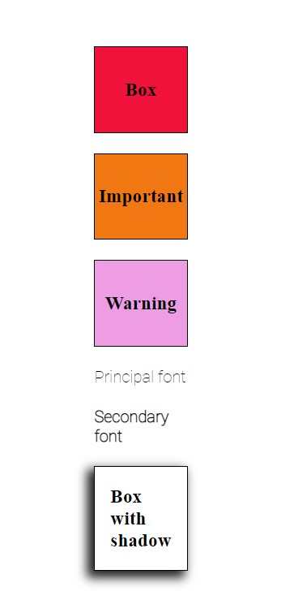

# Layout 2
Second exercise of Lemoncode Frontend Master's Degree Module 1 Layout.

# What did I use to develop this exercise? :thinking:

I used:

:art: HTML, CSS and SASS.  
:computer: Parcel.

# What is this exercise about? :thinking:

It is an exercise to learn how to do themes with SASS. I developed two themes (cold and hot theme) that you can apply to DOM, just changing the theme you are using in the code. 
Easy and clean.