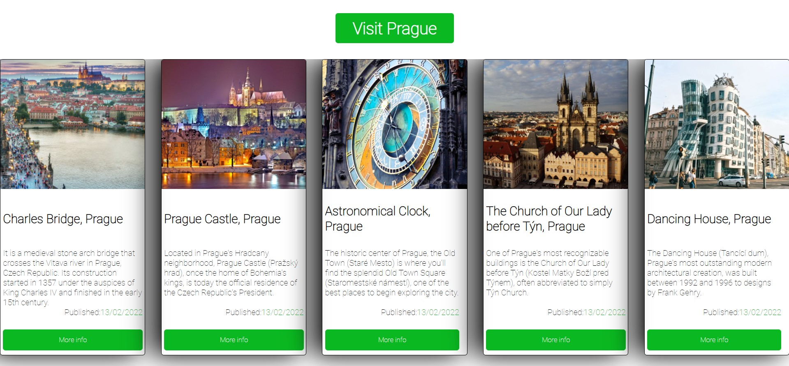

# Layout 4
Fourth exercise of Lemoncode Frontend Master's Degree Module 1 Layout.

# What did I use to develop this exercise? :thinking:

I used:

:art: HTML and CSS.

# What is this exercise about? :thinking:

It is an exercise to create a responsive web page with cards. I used CSS Grid and Flexbox.